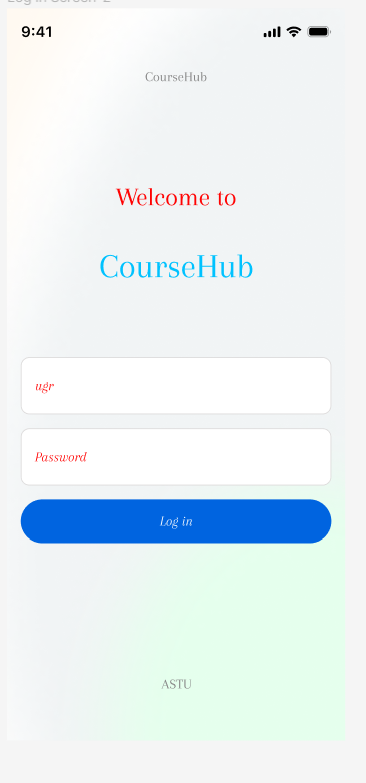

# ASTU CourseHub

## Project Description

The Course Hub mobile application is tailored exclusively for students at ASTU (Adama Science and Technology University). It provides a comprehensive suite of features and detailed course-related information to cater to the needs of the ASTU student community. The app serves as a centralized hub that streamlines course selection, academic planning, and access to essential university resources. Course Hub provides the following key features:

1. **User Registration***: Users can create an account within the app by providing their relevant information such as name, email address, and student ID. The registration process may also include password creation and validation.

2. **User Login**: Once registered, users can log in to the ASTU Course Hub using their credentials (email address and password). The app will authenticate the user's credentials before granting access to personalized features and information.

3. **User Profile**: After logging in, users can access and edit their profile information. They may have the option to update their contact details, profile picture, or other relevant information.

4. **Course Discussion Forum**: Each course listed in the ASTU Course Hub would have a dedicated discussion forum where students can post questions, share insights, and participate in discussions.

5. **Question Posting**: Students can post questions related to a specific course within the discussion forum. This can include inquiries about course content, assignments, projects, or any other related topics.

6. **Commenting and Replies**: Students can comment on existing questions or replies, providing answers, sharing their perspectives, or engaging in further discussion. This fosters a collaborative learning environment where students can assist and learn from one another.

7. **Upvoting and Downvoting**: To prioritize the most relevant and helpful contributions, users can upvote or downvote questions and comments. This helps highlight valuable insights and reduce clutter in the discussion forum.

8. **Notifications**: Users can opt to receive notifications when there are new comments or replies on questions they have posted or engaged with. This ensures that students stay updated and can actively participate in ongoing discussions.

9. **Course Instructor Participation**: Course instructors or teaching assistants can also access the discussion forum to provide clarifications, additional information, or guidance. Their participation can greatly enhance the learning experience for students.

10. **Moderation and Report System**: To maintain a respectful and productive environment, the app can incorporate moderation features and a report system. Users can report inappropriate or irrelevant content, and moderators can review and take appropriate actions.

11. **Course Information**: The app provides detailed descriptions of courses offered by each department. Students can easily browse through the available courses, view prerequisites, and gain a better understanding of the course content.

12. **Grade Calculator**: The ASTU Course Hub includes a grade calculator feature that allows students to calculate their cumulative grade point average (CGPA) and semester grade point average (GPA). By inputting their course grades and credit hours, students can track their academic progress and make informed decisions.

13. **Contact Details**: The application provides important contact details for faculty members, department heads, and administrative staff. Students can easily find and communicate with the relevant personnel for academic inquiries or administrative support.

14. **Block Numbers**: The app offers a directory of block numbers on the ASTU campus. Students can quickly locate classrooms, laboratories, libraries, and other facilities using the interactive map within the application.

## Technology Stack

### Front-end Development with Flutter

Flutter is a powerful UI toolkit developed by Google for building natively compiled applications for mobile, web, and desktop from a single codebase. Here's why we've chosen Flutter for the front-end:

- **Cross-Platform Compatibility**: Develop a single codebase compatible with both Android and iOS platforms.
- **Fast Development Process**: Utilize hot reload for instant UI changes during coding.
- **Rich UI Framework**: Create visually appealing and user-friendly interfaces.
- **Native Performance**: Ensure high performance and responsiveness.
- **Extensive Widget Library**: Access a wide range of UI elements and animations.
- **Reactive Programming Model**: Build reactive and data-driven UIs.
- **Strong Community Support**: Benefit from extensive documentation and community forums.

### Backend Development with Node.js

Node.js is a popular runtime environment for building scalable and high-performance server-side applications using JavaScript. Here's why we've chosen Node.js for the backend:

- **JavaScript Everywhere**: Seamlessly transition between front-end and backend development.
- **Asynchronous I/O**: Handle concurrent operations and I/O-bound tasks efficiently.
- **Scalability and Performance**: Ensure excellent scalability and performance.
- **NPM Ecosystem**: Integrate various functionalities with ease.
- **Express.js Framework**: Use Express.js for building robust and modular backend APIs.
- **Community Support**: Access extensive documentation and support resources.

## Conclusion
The CourseHub project appears to be a Flutter application that integrates with Firebase services. Here's a general summary of the project:

Authentication: The project uses Firebase Auth for user authentication, possibly allowing users to sign in with their Google accounts. The firebase_auth and google_sign_in packages are used for this purpose.
Database: The project likely uses Cloud Firestore, the NoSQL document database service provided by Firebase, to store and retrieve data related to courses, user profiles, and other application data. The cloud_firestore package is used for this.
UI Components: The project uses the flutterfire_ui package, which provides pre-built UI components for Firebase-related functionality, such as authentication screens and forms.
Theme Management: The project includes a theme management system, with the course_hub/theme/dark_mode.dart and course_hub/theme/theme_provider.dart files. This suggests that the application supports a dark mode or other theming options.
Login or Registration: The course_hub/auth/login_or_register.dart file indicates that the project has a screen or flow for users to either log in or register for the application.
State Management: The project uses the provider package, which suggests that it employs a state management approach, such as the Provider pattern, to manage the state of the application.
Overall, the CourseHub project appears to be a Flutter application that provides an educational platform or course management system. It integrates with Firebase services for authentication, database, and potentially other functionality, and it includes a customizable theme system and a login/registration flow for users.

By combining Flutter for the front-end and Node.js for the backend, we aim to deliver a professional and high-quality ASTU Course Hub that offers a seamless user experience across multiple platforms.

---

_For more information, please refer to the [documentation](docs/) or reach out to [coursehub@email.com](mailto:tamiratkebede120@email.com)._

    

    

    

    

        

        
    

    

